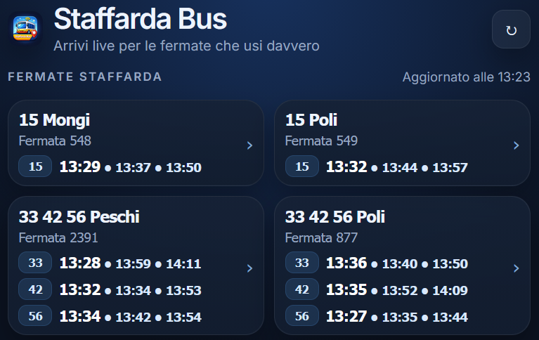

# Staffarda Bus

A simple web app that shows **live upcoming bus arrivals** for selected **GTT (Torino) bus stops**.

The project was built to quickly check the next buses for the stops I actually use, without opening the full GTT website.

## Features

* 🚍 Live upcoming bus arrivals
* ⚡ Fast and lightweight web interface
* 📱 Mobile-friendly layout
* 🔄 Real-time updates
* ☁️ Cloudflare Worker API

## How it works

The frontend calls a **Cloudflare Worker API** that fetches the arrival data from the official GTT website and converts it into clean JSON.

The worker:

1. Receives a bus stop ID (`stop`)
2. Requests the GTT arrivals page
3. Parses the HTML
4. Extracts lines and arrival times
5. Returns structured JSON

Example API request:

```
/api?stop=548
```

Example response:

```json
[
  {
    "line": "15",
    "times": ["13:13", "13:24", "13:31"]
  }
]
```

## Cloudflare Worker

The worker acts as a small proxy and parser for the GTT arrivals page.

It fetches:

```
https://www.gtt.to.it/cms/percorari/arrivi?palina=<STOP_ID>
```

Then extracts the bus lines and the next arrival times from the HTML.

## Customizing Stops

To use your own stops, simply edit the stop IDs in the frontend code.

Each stop corresponds to a **GTT stop number (palina)**.

Example:

```js
/api?stop=548
```

Replace the stop number with the one you want to monitor.

You can find stop IDs on the official GTT website.

## Screenshot



## Notes

This project is **not affiliated with GTT**.
It simply reads publicly available arrival information from their website.

## License

GNU