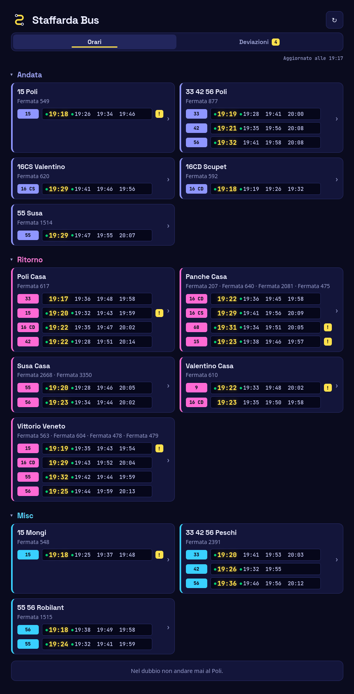

# Staffarda Bus

A simple web app that shows **live upcoming bus arrivals** for selected **GTT (Torino) bus stops**.

The project was built to quickly check the next buses for the stops I actually use, without opening the full GTT website.

## Features

* 🚍 Live upcoming bus arrivals, with a green dot on real-time (GPS) times
* 🔄 Auto-refresh every ~45 seconds and when you come back to the app
* ⚠️ Line deviation alerts, linked to the GTT stop page
* 🗂️ Stops grouped into collapsible sections (Andata, Ritorno, Misc)
* 📱 Installable PWA: works offline and shows the last downloaded times
* ⚡ Single static file, no dependencies, no build step

## How it works

Everything runs in the browser from `index.html`. For each stop the app uses two data sources:

1. **[GPA](https://gpa.madbob.org) (primary)**: `https://gpa.madbob.org/query.php?stop=<STOP_ID>` returns real-time and scheduled arrivals.
   When a real-time arrival is within 3 minutes of a scheduled one, only the real-time one is kept.
2. **Cloudflare Worker (fallback and alerts)**: used when GPA fails or doesn't answer within 5 seconds, and to read line deviation alerts.

Times are shown as absolute clock times (e.g. `12:53`) and buses that have already passed disappear automatically.

## Cloudflare Worker

The worker (not included in this repository) acts as a small proxy and parser for the GTT arrivals page.

It fetches:

```
https://www.gtt.to.it/cms/percorari/arrivi?palina=<STOP_ID>
```

Then extracts the bus lines and the next arrival times from the HTML and returns structured JSON.

Example request:

```
https://staffarda-bus-api.lorenzo-tegliucci.workers.dev/?stop=548
```

Example response:

```json
[
  {
    "line": "15",
    "times": ["13:13", "13:24", "13:31"]
  }
]
```

Deviation alerts come back as entries whose `line` starts with the line number followed by the deviation text (e.g. `"15 deviata ..."`).

## PWA and offline

* `manifest.json` makes the app installable, with a maskable icon for Android and an `apple-touch-icon` for iOS.
* `sw.js` caches the app shell: the page is loaded network-first (falling back to the cache after 3 seconds or when offline), icons and manifest cache-first. API requests are not cached by the service worker.
* The last arrivals and alerts are saved in `localStorage`, so on launch the app shows them immediately ("Dati delle HH:MM") while fresh data loads. Data older than 2 hours is ignored.

If you change the icons or the manifest, bump the `CACHE` version in `sw.js` so installed apps pick up the new files.

## Customizing Stops

Edit the `config` array at the top of the `<script>` in `index.html`.
Each stop has a name and one or more **GTT stop numbers (palina)**, each with the lines to show:

```js
// Single palina
{ name: '15 Poli', code: '549', show: ['15'] },

// Several paline merged into one card
{ name: 'Susa Casa', sources: [
    { code: '2668', show: ['55'] },
    { code: '3350', show: ['56'] },
  ]},
```

You can find stop numbers on the official GTT website.

## Screenshot



## Notes

This project is **not affiliated with GTT**.
It simply reads publicly available arrival information from their website and from the GPA service.

## License

GNU General Public License v3.0. See [LICENSE](LICENSE).
